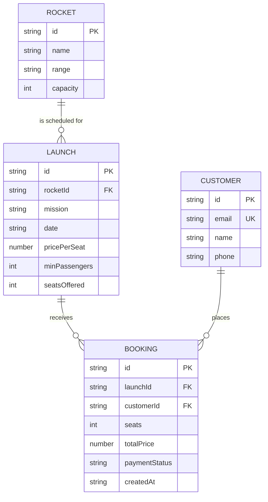

# AstroBookings Entity-Relationship Model

## Entities

### Rocket

- **id**: string (UUID, primary key)
- **name**: string (non-empty)
- **range**: enum (`suborbital` | `orbital` | `moon` | `mars`)
- **capacity**: integer (1..10)

- A rocket can be scheduled in many launches.

### Launch

- **id**: string (UUID, primary key)
- **rocketId**: string (foreign key → Rocket.id)
- **mission**: string (non-empty)
- **date**: string (ISO date, must be in the future)
- **pricePerSeat**: number (positive)
- **minPassengers**: integer (<= seatsOffered)
- **seatsOffered**: integer (<= rocket.capacity)

- A launch belongs to exactly one rocket.
- A launch can receive many bookings.
- Seat availability is derived (seatsOffered minus the sum of booked seats).

### Customer

- **id**: string (UUID, primary key)
- **email**: string (non-empty, unique natural key)
- **name**: string (non-empty)
- **phone**: string (non-empty)

- A customer is uniquely identified by `email`.
- A customer can hold many bookings.

### Booking

- **id**: string (UUID, primary key)
- **launchId**: string (foreign key → Launch.id)
- **customerId**: string (foreign key → Customer.id)
- **seats**: integer (<= remaining available seats on the launch)
- **totalPrice**: number (seats * launch.pricePerSeat)
- **paymentStatus**: enum (mock payment result)
- **createdAt**: string (ISO timestamp)

- A booking links one customer to one launch.

## Relationships

